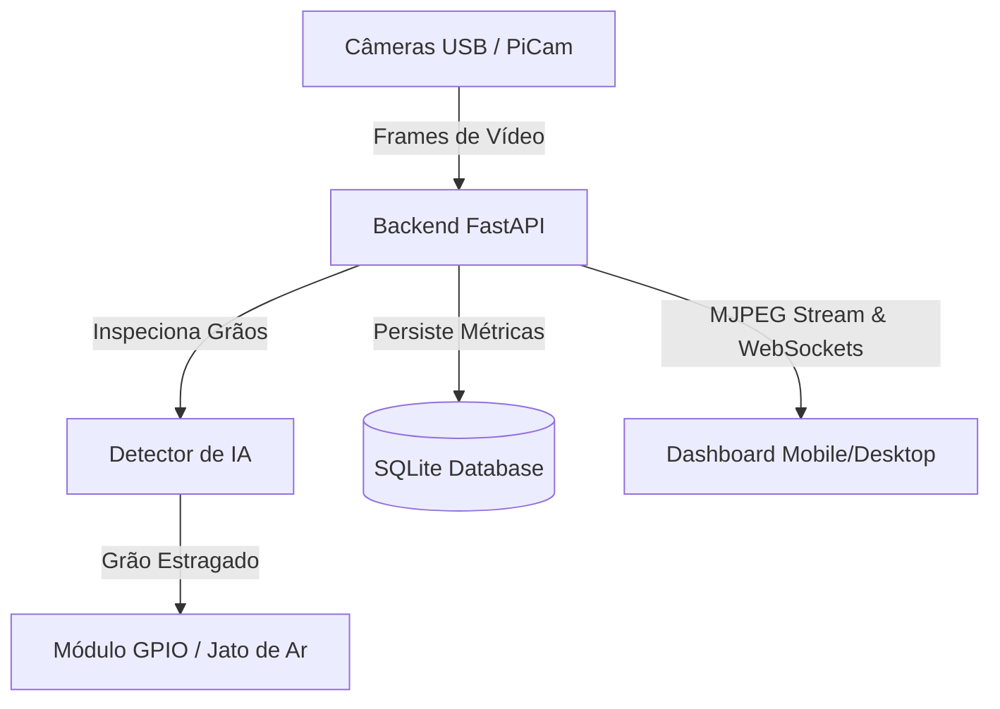

# Arquitetura do Sistema de Reconhecimento de Grãos

Este documento descreve a arquitetura simplificada projetada para rodar em Raspberry Pi ou computadores locais, utilizando inteligência artificial para classificar grãos e acionar um mecanismo de ejeção pneumática (jato de ar).

## 1. Visão Geral do Sistema

O sistema é composto por uma única aplicação unificada em Python (**FastAPI**) e um front-end estático embutido (**HTML5/Vanilla CSS/JS**). Esta abordagem de serviço único minimiza o overhead e facilita a implantação no Raspberry Pi.

## 2. Componentes de Software

### 2.1 Backend (Python)
- **FastAPI / Uvicorn**: Servidor web rápido para expor a API de controle, streaming de vídeo em tempo real e entrega do painel estático.
- **Detector de IA (YOLOv9t / ONNX / CV)**: Prioridade: (1) Ultralytics YOLOv9t treinado no Coffee Bean Dataset (`models/coffee_beans_yolov9t/weights/best.pt`); (2) ONNX exportado para Raspberry Pi; (3) fallback por contornos e cor. Pipeline de treino em `ml/` (download Roboflow, `train_yolov9t.py`, `export_model.py`).
- **Processamento de Câmera (OpenCV)**: Loop assíncrono em thread separada para captura contínua de frames. Suporta câmeras USB genéricas (`/dev/video*`) e câmera nativa do Raspberry Pi via backend OpenCV compatível.
- **Controle GPIO (Pino de Válvula / Soprador)**: Interface de acionamento do solenoide para o jato de ar. Utiliza um padrão de fallback (Mock GPIO no PC local, e `gpiozero`/`RPi.GPIO` no Raspberry Pi).
- **Banco de Dados (SQLite)**: Banco embarcado leve para armazenar o histórico de contagem de grãos processados, divididos por grupos (Saudáveis, Estragados, Outros).

### 2.2 Frontend (Web UI)
- **HTML5 & Vanilla CSS**: Painel moderno e responsivo (Desktop & Mobile) utilizando um design escuro premium (Glassmorphism, gradientes modernos e micro-animações).
- **Chart.js**: Renderização de gráficos dinâmicos das métricas de grãos.
- **MJPEG Player**: Exibição do feed de vídeo em tempo real através de uma tag `` padrão, com excelente desempenho e compatibilidade móvel.

## 3. Segurança e Acesso Remoto
- **Autenticação**: Acesso à API e ao painel protegido por autenticação simples de token ou senha.
- **Túnel Seguro**: Recomendação para uso de **Tailscale** ou **Wireguard** para acesso externo sem necessidade de abrir portas no roteador da rede onde o Raspberry Pi está conectado.

## 4. Controle de Ejeção (Jato de Ar)
- O pino GPIO configurado emite um sinal digital em nível alto (`HIGH`) por uma duração parametrizável (ex: 100ms) imediatamente após a detecção de um grão estragado na zona de ejeção.
- O sinal ativa um relé ou transistor de potência (MOSFET) que chaveia a alimentação da válvula solenoide pneumática.

## 5. Rejeição de Ruído e Coleta de Dataset
- **Rejeição de Ruído de Fundo**: Para evitar detecções falsas quando a câmera física está apontada para um fundo vazio/estático, o sistema realiza uma análise dinâmica de contraste global. Se o contraste for inferior a um limite seguro (ex: 45), a segmentação é ignorada, garantindo zero detecções incorretas.
- **Modo Simulação Inteligente**: A geração de grãos falsos para fins demonstrativos é restrita ao modo em que a própria câmera física não pôde ser inicializada.
- **Exportação do Dataset (Imagens de Grãos)**: O sistema salva recortes (crops) individuais de cada grão detectado nas pastas `/dataset/healthy` e `/dataset/damaged`, respectivamente, assim que são classificados com sucesso, facilitando a coleta automática de fotos reais para treinamento posterior de modelos de Deep Learning (como YOLO ou MobileNet).
