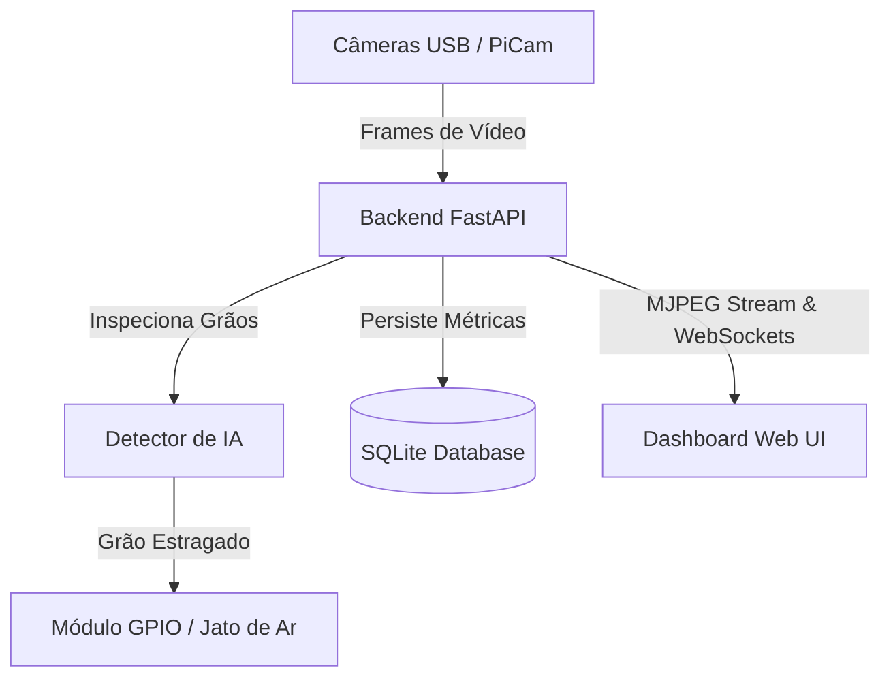

# ☕ Sistema de Reconhecimento de Grãos de Café

Detecção, classificação e contagem de grãos de café em tempo real utilizando **YOLOv9t** e visão computacional clássica. O sistema possui uma interface web (dashboard interativo), persistência em SQLite, gravação de feeds e controle GPIO para acionamento de um atuador físico (jato de ar) para descarte de grãos defeituosos. Projetado para rodar em computadores locais ou dispositivos embarcados como **Raspberry Pi 4 / 5**.

---

## 📌 Índice
1. [Visão Geral & Arquitetura](#-visão-geral--arquitetura)
2. [Instalação e Configuração](#-instalação-e-configuração)
3. [Setup da Pasta `data/` (Preparações do Dataset)](#-setup-da-pasta-data-preparações-do-dataset)
   - [Diferença entre `data/` e `dataset/`](#diferença-entre-data-e-dataset)
   - [Opção A: Download Automático (Hugging Face ou Roboflow)](#opção-a-download-automático-hugging-face-ou-roboflow)
   - [Opção B: Montar seu Dataset Próprio (Manual)](#opção-b-montar-seu-dataset-próprio-manual)
   - [Estrutura de Arquivos do Dataset](#estrutura-de-arquivos-do-dataset)
   - [Formato das Anotações YOLO](#formato-das-anotações-yolo)
4. [Treinamento de Identificação com YOLOv9t](#-treinamento-de-identificação-com-yolov9t)
   - [Executando o Script de Treino](#executando-o-script-de-treino)
   - [Opções de Linha de Comando](#opções-de-linha-de-comando)
   - [Exemplos de Treinamento (CPU vs GPU)](#exemplos-de-treinamento-cpu-vs-gpu)
   - [Entendendo o Fluxo de Saída do Treinamento](#entendendo-o-fluxo-de-saída-do-treinamento)
5. [Validação do Modelo](#-validação-do-modelo)
6. [Exportação para ONNX (Otimização para Raspberry Pi)](#-exportação-para-onnx-otimização-para-raspberry-pi)
7. [Executando o Sistema Completo](#-executando-o-sistema-completo)
   - [Variáveis de Ambiente Disponíveis](#variáveis-de-ambiente-disponíveis)
   - [Executar com YOLO (Pesos PyTorch)](#executar-com-yolo-pesos-pytorch)
   - [Executar com YOLO (ONNX Otimizado)](#executar-com-yolo-onnx-otimizado)
   - [Executar em Modo Fallback (Sem YOLO / Visão Clássica)](#executar-em-modo-fallback-sem-yolo--visão-clássica)
8. [Integração de Hardware (Raspberry Pi)](#-integração-de-hardware-raspberry-pi)
9. [Solução de Problemas (Troubleshooting)](#-solução-de-problemas-troubleshooting)

---

## 🏗️ Visão Geral & Arquitetura

O sistema é construído como uma aplicação de serviço único unificada usando **FastAPI** para o backend e **Vanilla HTML/CSS/JS** para o frontend. Essa abordagem reduz a sobrecarga computacional de rede no Raspberry Pi.



Para mais detalhes das decisões arquiteturais e fluxos de contraste e segurança, leia o arquivo [ARCHITECTURE.md](file:///home/roma/Documentos/Raspberry-grain-Analysis/ARCHITECTURE.md).

---

## ⚙️ Instalação e Configuração

### 1. Clonar ou Entrar no Diretório do Projeto
Abra seu terminal e acesse a pasta raiz do projeto:
```bash
cd Raspberry-grain-Analysis
```

### 2. Criar e Ativar Ambiente Virtual (venv)
É altamente recomendado o uso de um ambiente virtual isolado para não misturar as dependências com o Python do sistema operacional:
```bash
python3 -m venv .venv
source .venv/bin/activate
```
*Após a ativação, você verá `(.venv)` no início da linha de prompt. Para sair a qualquer momento, digite `deactivate`.*

### 3. Instalação das Dependências
O projeto divide os requisitos em dois arquivos:
*   **`requirements.txt`**: Apenas as dependências leves necessárias para rodar o backend e o modo de visão clássica (perfeito para o Raspberry Pi de execução).
*   **`requirements-ml.txt`**: Inclui bibliotecas adicionais pesadas de Deep Learning (`ultralytics`, `torch`, `torchvision`, `huggingface_hub`, `roboflow`) necessárias para a preparação de datasets e treinamento do YOLO.

Se você está na sua máquina de desenvolvimento/treino (que possui GPU ou CPU rápida), instale as dependências completas de ML:
```bash
pip install -r requirements-ml.txt
```

Para verificar se o ambiente de ML está configurado corretamente, rode:
```bash
python -c "import torch; import ultralytics; print('CUDA disponível:', torch.cuda.is_available())"
```

---

## 📂 Setup da Pasta `data/` (Preparações do Dataset)

### Diferença entre `data/` e `dataset/`
Para evitar confusões de diretórios durante a operação do sistema:
*   📂 **`data/`**: É a pasta destinada a armazenar o conjunto de dados para **treinamento e validação** da rede neural YOLO. Suas subpastas contêm milhares de imagens e rótulos de treino.
*   📂 **`dataset/`**: É uma pasta criada automaticamente pelo backend durante a **execução em tempo real** (`main.py`). O sistema salva nela recortes (crops) individuais de grãos detectados e categorizados (`dataset/healthy/` e `dataset/damaged/`) pelo feed da câmera para que você possa utilizá-los futuramente como novas fotos de treino.

---

### Opção A: Download Automático (Hugging Face ou Roboflow)

O script `ml/download_dataset.py` facilita a aquisição automática de imagens anotadas e cria toda a estrutura correta em `data/coffee_beans/`.

#### 1. Via Hugging Face (Fonte Gratuita e Padrão)
Baixa o dataset público `SamruddhK/coffee-bean-grading-dataset` contendo cerca de 2284 imagens com anotações LabelMe (polígonos em formato JSON), convertendo-os automaticamente para o formato de caixas envolventes (bounding boxes) do YOLO.
```bash
python ml/download_dataset.py --source huggingface
```
*Nota: Este download pode levar alguns minutos devido ao volume de imagens. Ele gerará a pasta `data/coffee_beans/` e o arquivo de configuração `data.yaml` pronto para o treino.*

#### 2. Via Roboflow (Requer Chave de API)
Caso possua uma conta no Roboflow e queira baixar a versão direta do `CoffeeBeansGradingV3`:
```bash
export ROBOFLOW_API_KEY=sua_chave_de_api
python ml/download_dataset.py --source roboflow
```

---

### Opção B: Montar seu Dataset Próprio (Manual)

Se você preferir capturar fotos personalizadas da sua própria câmera (ou utilizar os recortes acumulados na pasta `dataset/` após rodar o sistema), você pode criar manualmente um novo dataset.

#### Estrutura de Arquivos do Dataset
Crie uma pasta com a estrutura abaixo dentro do diretório `data/` (por exemplo, `data/meu_cafe/`):
```text
data/
└── meu_cafe/
    ├── data.yaml
    ├── train/
    │   ├── images/
    │   │   ├── foto1.jpg
    │   │   └── foto2.jpg
    │   └── labels/
    │       ├── foto1.txt
    │       └── foto2.txt
    └── valid/
        ├── images/
        │   └── foto3.jpg
        └── labels/
            └── foto3.txt
```

> 💡 **Dica:** O YOLO exige que para cada arquivo de imagem (`foto1.jpg`) na pasta `images/`, exista um arquivo de texto com o mesmo nome exato (`foto1.txt`) na pasta `labels/` correspondente contendo as marcações geométricas.

#### Formato das Anotações YOLO
As anotações nas labels devem ser em formato texto simples (UTF-8). Cada linha do arquivo representa um grão detectado, seguindo a estrutura:
```text
<classe_id> <x_centro> <y_centro> <largura> <altura>
```
*   **`classe_id`**: O índice da classe (por padrão `0` para **defect** e `1` para **premium**).
*   **Valores Geométricos**: Devem ser coordenadas normalizadas (entre `0.0` e `1.0`) em relação ao tamanho total da imagem (largura e altura).
    - `x_centro`: Posição X central da caixa.
    - `y_centro`: Posição Y central da caixa.
    - `largura`: Largura da caixa delimitadora do grão.
    - `altura`: Altura da caixa delimitadora do grão.

*Exemplo de arquivo de label (`foto1.txt`) contendo dois grãos (um premium e um defeituoso):*
```text
1 0.523400 0.412000 0.152000 0.180000
0 0.231000 0.654000 0.120000 0.145000
```

#### Mapeamento de Classes e Status
Durante o treino, o YOLO aprende a identificar as classes baseadas nos nomes listados em `data.yaml`. No entanto, internamente o sistema de controle web e ejeção mapeia estas classes para os estados `"healthy"` (saudável) e `"damaged"` (danificado). 

Esse mapeamento ocorre no arquivo [ml/class_mapping.py](file:///home/roma/Documentos/Raspberry-grain-Analysis/ml/class_mapping.py). Por padrão:
*   `premium` ou `healthy` ➔ `healthy` (Grão bom, não aciona descarte)
*   `defect`, `damaged` ou defeitos específicos (`black`, `broken`, `sour`, `fade`) ➔ `damaged` (Grão defeituoso, aciona o jato de ar)

#### Gerando o Arquivo `data.yaml`
Crie um arquivo chamado `data.yaml` na raiz da pasta do seu dataset (ex: `data/meu_cafe/data.yaml`):
```yaml
# Caminho absoluto da pasta do seu dataset
path: /home/seu_usuario/Raspberry-grain-Analysis/data/meu_cafe
train: train/images
val: valid/images

# Número de classes
nc: 2
names:
  0: defect
  1: premium
```

---

## 🧠 Treinamento de Identificação com YOLOv9t

O treinamento utiliza o modelo **YOLOv9t** (YOLOv9 Tiny), que oferece excelente precisão de detecção mantendo-se leve o suficiente para ser executado ou exportado para hardware de baixo custo.

### Executando o Script de Treino
O script `ml/train_yolov9t.py` inicializa o processo de treinamento usando a API da biblioteca `ultralytics`. 

### Opções de Linha de Comando
Você pode passar diversos parâmetros para o script para ajustar o desempenho e a qualidade do modelo:
*   `--data`: Caminho para o seu arquivo `data.yaml` (padrão: `data/coffee_beans/data.yaml`).
*   `--epochs`: Número de épocas de treinamento (passadas completas pelo dataset). Padrão: `100`.
*   `--imgsz`: Tamanho da resolução da imagem para treino. Padrão: `640` (pode ser reduzido para `416` para agilizar treinos rápidos ou em CPUs).
*   `--batch`: Tamanho do lote (batch size). Quantas imagens são passadas de uma vez para processamento. Padrão: `16`.
*   `--device`: Define onde o treino rodará: `cpu`, `0` (primeira GPU NVIDIA) ou deixar em branco para auto-seleção.
*   `--export-onnx`: Se presente, converte automaticamente o melhor modelo resultante (`best.pt`) em um arquivo ONNX otimizado assim que o treino finalizar.

---

### Exemplos de Treinamento (CPU vs GPU)

#### 🚀 Com GPU NVIDIA (Muito mais rápido - recomendado)
Para rodar em sua placa de vídeo com batch size padrão e 100 épocas:
```bash
python ml/train_yolov9t.py \
  --data data/coffee_beans/data.yaml \
  --epochs 100 \
  --imgsz 640 \
  --batch 16 \
  --device 0 \
  --export-onnx
```

#### 💻 Com CPU (Lento - para testes rápidos ou ambientes sem placa dedicada)
Reduzimos as épocas, o tamanho do batch e o tamanho das imagens para acelerar a finalização:
```bash
python ml/train_yolov9t.py \
  --data data/coffee_beans/data.yaml \
  --epochs 10 \
  --imgsz 416 \
  --batch 4 \
  --device cpu
```

---

### Entendendo o Fluxo de Saída do Treinamento
1.  **Carregamento de Pesos Base**: O script tentará carregar os pesos base `models/pretrained/yolov9t.pt`. Se não existirem localmente, ele fará o download automático dos pesos pré-treinados oficiais da Ultralytics na internet.
2.  **Ciclo de Treino e Logs**: Durante a execução, as estatísticas de perda e métricas mAP (Mean Average Precision) serão exibidas a cada época e salvas na pasta `runs/detect/coffee_beans_yolov9t/`.
3.  **Cópia de Produção**: Após a conclusão bem-sucedida, o script localiza o melhor arquivo de pesos treinado (`best.pt`) no diretório de execuções do YOLO e copia-o automaticamente para a pasta de produção final do projeto:
    *   📂 **`models/coffee_beans_yolov9t/weights/best.pt`**
4.  **Criação de ONNX**: Se a flag `--export-onnx` foi passada, o script invocará o exportador e criará também o arquivo `best.onnx` no mesmo diretório de destino.

---

## 📊 Validação do Modelo

Para avaliar e medir a precisão (mAP50 e mAP50-95) do seu modelo treinado contra o split de validação/teste sem subir a interface visual, execute o validador:
```bash
python ml/validate_model.py \
  --weights models/coffee_beans_yolov9t/weights/best.pt \
  --data data/coffee_beans/data.yaml
```
Ele exibirá uma matriz de confusão e métricas precisas sobre a assertividade em relação aos grãos premium e com defeitos.

---

## ⚡ Exportação para ONNX (Otimização para Raspberry Pi)

O framework PyTorch (usado pelos arquivos `.pt`) é pesado e consome muita memória RAM e CPU, tornando-o inviável para rodar com alta taxa de quadros (FPS) no Raspberry Pi. A alternativa ideal é exportar o modelo para o formato **ONNX**, permitindo que o OpenCV faça a inferência leve via C++ internamente.

Para exportar manualmente um modelo existente `.pt` para `.onnx`:
```bash
python ml/export_model.py \
  --weights models/coffee_beans_yolov9t/weights/best.pt \
  --imgsz 640
```
O arquivo otimizado será gerado em:
*   📂 **`models/coffee_beans_yolov9t/weights/best.onnx`**

---

## 🚀 Executando o Sistema Completo

### Variáveis de Ambiente Disponíveis
Você pode configurar dinamicamente o comportamento de detecção alterando variáveis de ambiente antes de executar o script `main.py`:
*   `YOLO_MODEL_PATH`: Caminho absoluto ou relativo para os pesos do PyTorch (`best.pt`).
*   `YOLO_ONNX_PATH`: Caminho absoluto ou relativo para o modelo otimizado (`best.onnx`).
*   `YOLO_CONF`: Limite de confiança mínimo para aceitar uma detecção (padrão: `0.5`).
*   `YOLO_DEVICE`: Dispositivo utilizado para inferência de PyTorch (`cpu`, `cuda` ou `0`).
*   `YOLO_SKIP_FRAMES`: Número de frames para pular inferência e exibir o feed direto (padrão: `0`). Útil para hardware limitado como o Raspberry Pi (valores recomendados: `1` ou `2`).

---

### Executar com YOLO (Pesos PyTorch)
Ideal para computadores com placa de vídeo dedicada ou CPUs robustas:
```bash
export YOLO_MODEL_PATH=models/coffee_beans_yolov9t/weights/best.pt
export YOLO_CONF=0.6
python main.py
```

### Executar com YOLO (ONNX Otimizado)
**Configuração recomendada e priorizada automaticamente pelo sistema**. Se o arquivo `.onnx` estiver presente na pasta `models/coffee_beans_yolov9t/weights/`, ele será carregado primeiro por padrão:
```bash
export YOLO_ONNX_PATH=models/coffee_beans_yolov9t/weights/best.onnx
# Opcional: pular 2 a cada 3 frames de IA para manter o stream a 30 FPS sem lag na CPU
export YOLO_SKIP_FRAMES=2
python main.py
```

### Executar em Modo Fallback (Sem YOLO / Visão Clássica)
Se você remover os modelos `.pt` e `.onnx` ou quiser testar sem IA, o sistema iniciará utilizando segmentação clássica por contornos e cor para discernir grãos escuros/danificados de claros/saudáveis:
```bash
python main.py
```
*Após rodar, abra o navegador em **http://localhost:8000** para ver o painel de métricas e o streaming de vídeo.*

---

## 🔌 Integração de Hardware (Raspberry Pi)

Para implementar a ejeção física de grãos defeituosos, conecte uma eletroválvula de ar comprimido no Raspberry Pi:
*   **Pino de Sinal (Válvula):** Pino físico **18** (BCM 18) do Raspberry Pi.
*   **Circuito Recomendado:**
    ```text
    [Raspberry Pi GPIO 18] ➔ Resistor 220Ω ➔ Gate do MOSFET (Ex: IRLZ44N)
    [Fonte Externa 12V V+] ➔ Solenoide Válvula (+)
    [Solenoide Válvula (-)] ➔ Dreno do MOSFET (D)
    [Fonte Externa GND    ] ➔ Source do MOSFET (S) ➔ GND do Raspberry Pi
    * Lembre-se de colocar um diodo de roda livre (Ex: 1N4007) em paralelo reversamente na solenoide para evitar picos de contracorrente.
    ```
O tempo de acionamento do pino de ar pode ser ajustado diretamente nas configurações do painel web.

---

## 🛠️ Solução de Problemas (Troubleshooting)

| Sintoma / Erro | Causa Provável | Solução |
| :--- | :--- | :--- |
| `ModuleNotFoundError: No module named 'ultralytics'` | Ambiente virtual desativado ou dependências de ML ausentes. | Execute `source .venv/bin/activate` e instale as dependências corretas com `pip install -r requirements-ml.txt`. |
| `Dataset não encontrado: data/coffee_beans/data.yaml` | O dataset de treino ainda não foi configurado ou baixado. | Execute `python ml/download_dataset.py --source huggingface` para baixar automaticamente. |
| O treino está extremamente lento (horas por época). | O treinamento está rodando na CPU. | Se você tiver uma placa de vídeo NVIDIA, adicione a opção `--device 0` ao comando de treino. Se não tiver, diminua o treino para `--epochs 5 --imgsz 416 --batch 4`. |
| `Error: download_huggingface dependency 'huggingface_hub' missing` | Você está executando o python do sistema global ao invés do Python do ambiente virtual. | Execute especificando o caminho do venv: `.venv/bin/python ml/download_dataset.py --source huggingface`. |
| Câmera não inicia / Feed preto. | OpenCV não conseguiu encontrar a câmera USB ou permissão negada. | Verifique se a câmera está conectada (`ls /dev/video*`). Se estiver no Raspberry Pi, certifique-se de que habilitou a câmera na ferramenta `raspi-config`. |
| Taxa de frames (FPS) baixa no Raspberry Pi. | O script está carregando o arquivo `.pt` via PyTorch, que é pesado para o processador do Pi. | Exporte o modelo para ONNX com `python ml/export_model.py` e rode o servidor definindo `export YOLO_ONNX_PATH=models/coffee_beans_yolov9t/weights/best.onnx`. |
